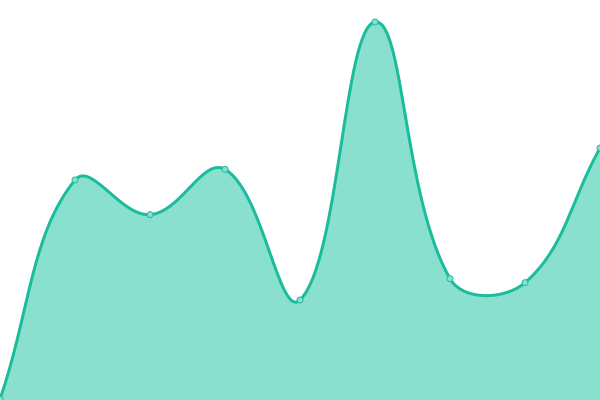

<!--start: status pages-->
<!-- This summary is generated by Upptime (https://github.com/upptime/upptime) -->
<!-- Do not edit this manually, your changes will be overwritten -->
<!-- prettier-ignore -->
| URL | Status | History | Response Time | Uptime |
| --- | ------ | ------- | ------------- | ------ |
|  [Main Website](https://zxce3.net) | 🟩 Up | [main-website.yml](https://github.com/Zxce3/status/commits/HEAD/history/main-website.yml) | 

 161ms
     
 | 

<a href="https://status.zxce3.net/history/main-website">100.00%</a>
    

|  [Blog](https://blog.zxce3.net) | 🟩 Up | [blog.yml](https://github.com/Zxce3/status/commits/HEAD/history/blog.yml) | 

 267ms
     
 | 

<a href="https://status.zxce3.net/history/blog">100.00%</a>
    

|  [API](https://api.zxce3.net) | 🟩 Up | [api.yml](https://github.com/Zxce3/status/commits/HEAD/history/api.yml) | 

 228ms
     
 | 

<a href="https://status.zxce3.net/history/api">100.00%</a>
    

|  [Files](https://files.zxce3.net) | 🟩 Up | [files.yml](https://github.com/Zxce3/status/commits/HEAD/history/files.yml) | 

 227ms
     
 | 

<a href="https://status.zxce3.net/history/files">100.00%</a>
    

|  [Status](https://status.zxce3.net) | 🟩 Up | [status.yml](https://github.com/Zxce3/status/commits/HEAD/history/status.yml) | 

 156ms
     
 | 

<a href="https://status.zxce3.net/history/status">100.00%</a>
    

<!--end: status pages-->
