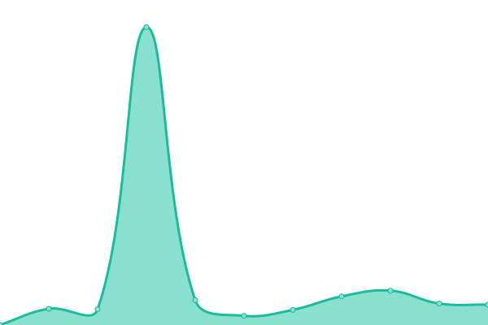
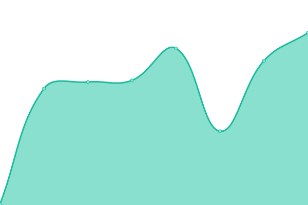

# Status

This is the status page for zxce3, you can check the status of our services from here.

<!--start: status pages-->
<!-- This summary is generated by Upptime (https://github.com/upptime/upptime) -->
<!-- Do not edit this manually, your changes will be overwritten -->
<!-- prettier-ignore -->
| URL | Status | History | Response Time | Uptime |
| --- | ------ | ------- | ------------- | ------ |
|  [Main Website](https://zxce3.net) | 🟥 Down | [main-website.yml](https://github.com/Zxce3/status/commits/HEAD/history/main-website.yml) | 

 0ms
     
 | 

<a href="https://status.zxce3.net/history/main-website">0.00%</a>
    

|  [API](https://api.zxce3.net) | 🟥 Down | [api.yml](https://github.com/Zxce3/status/commits/HEAD/history/api.yml) | 

 0ms
     
 | 

<a href="https://status.zxce3.net/history/api">0.00%</a>
    

|  [Files](https://files.zxce3.net) | 🟥 Down | [files.yml](https://github.com/Zxce3/status/commits/HEAD/history/files.yml) | 

 0ms
     
 | 

<a href="https://status.zxce3.net/history/files">0.00%</a>
    

|  [Status](https://status.zxce3.net) | 🟥 Down | [status.yml](https://github.com/Zxce3/status/commits/HEAD/history/status.yml) | 

 0ms
     
 | 

<a href="https://status.zxce3.net/history/status">0.00%</a>
    

<!--end: status pages-->
